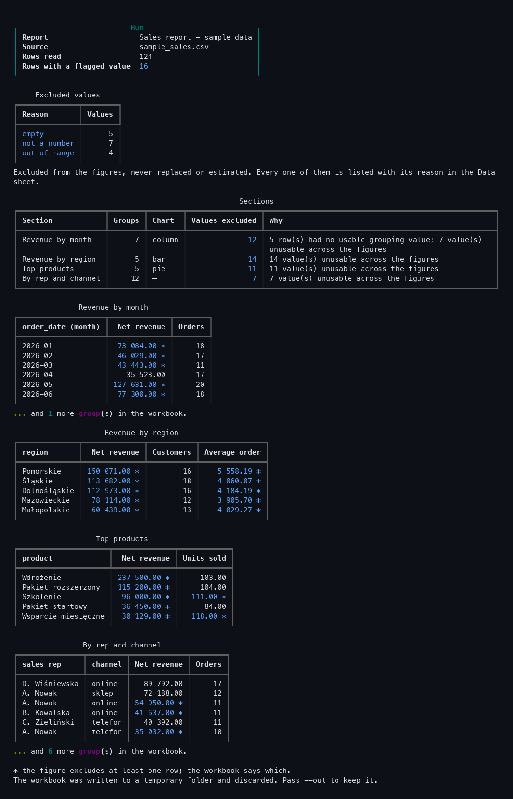

# report-builder

Turns a CSV, Excel or JSON file into a formatted Excel report with native charts, driven by
a configuration file rather than by code.



The view above is one command, run against the bundled sample data:

```bash
./.venv/bin/python -m report_builder demo
```

## Context

This is a personal tool, written by its author for his own freelance work. It has no client,
no users other than its author, and it has never been sold or deployed. It exists because
*raport* is one of the words that keeps appearing in the job listings he answers.

## What comes out

One workbook:

- **Summary** — what the report is, what it was built from, how many rows went in, and how
  many values had to be left out and why. First sheet, so it is what opens.
- **One sheet per section** — the grouped table, with its chart anchored beside it.
- **Data** — every source row, plus a `status` column saying whether the row was usable and,
  when it was not, exactly what was wrong with it.

No sheet is hidden and no range is protected.

## The three things it does not do

**It does not hide the chart's data.** The table a chart is drawn from sits on a normal,
visible sheet. Correct a figure there and the chart moves — which is the only reason to ship
native charts rather than pictures. A test asserts that every sheet in the workbook is
`visible` and that each chart's range points at its own section sheet.

**It does not fill a gap.** A value that cannot be read is excluded from the figures that
would have used it, and the reason is written into the `status` column next to the original
text. It is never interpolated, never carried forward from the row above, and never replaced
by zero. A group with no usable value at all comes out as an **empty cell with a comment**,
not as `0` — because `0` is a measurement and an empty cell is an absence, and a report that
confuses the two is worse than no report.

**It does not decide per row.** Exclusion is per figure. A row whose amount is unreadable can
still be counted by a `count` over another column; throwing the whole row away would discard
good data to punish one bad cell.

## Configuration, not code

Nothing about any particular dataset appears in the source. Pointing the tool at a different
file means writing a different configuration:

```json
{
  "title": "Sales report",
  "columns": {
    "order_date": { "type": "date", "required": true },
    "net_amount": { "type": "number", "required": true, "min": 0 },
    "quantity":   { "type": "number", "min": 1, "max": 100 }
  },
  "sections": [
    {
      "name": "Revenue by month",
      "group_by": ["month(order_date)"],
      "aggregations": [
        { "column": "net_amount", "function": "sum",   "label": "Net revenue" },
        { "column": "order_id",   "function": "count", "label": "Orders" }
      ],
      "chart": { "type": "column", "values": ["Net revenue"] }
    }
  ]
}
```

- **Grouping**: a plain column name, or `year(col)`, `quarter(col)`, `month(col)`,
  `week(col)`, `day(col)`. Several keys give a compound group.
- **Aggregations**: `sum`, `mean`, `min`, `max`, `count`, `count_distinct`.
- **Charts**: `column`, `bar`, `line`, `pie`.
- **Per section**: `sort_by` one of its own figures, `top` to keep the first N groups.

A mistake in the configuration stops the run and names the problem — an unknown function
lists the valid ones, a chart plotting a figure the section does not compute says so, and a
column the source does not have prints the columns it does have. None of those produce a
half-empty report.

## The charts are openpyxl's, unstyled

They are real Excel chart objects bound to cell ranges, built by
[openpyxl](https://openpyxl.readthedocs.io/). **Their appearance is whatever openpyxl and the
spreadsheet application produce** — default colours, default fonts, default legend placement.
Nothing here restyles them, and this README is not going to describe them as designed.

That is the trade that was chosen deliberately: a rendered image would look better and would
be dead. A native chart can be edited, re-pointed at a different range, restyled by the
recipient in two clicks, and it updates when the numbers beside it change.

## Install and run

```bash
python3 -m venv .venv
./.venv/bin/pip install -r requirements.txt
```

```bash
./.venv/bin/python -m report_builder build samples/sample_sales.csv \
    --config samples/sample_report.json --out report.xlsx
```

| Option | Effect |
|---|---|
| `--config c.json` | The report definition. Required. |
| `--out r.xlsx` | Output workbook (default: `<input>.report.xlsx`) |
| `--sheet "sprzedaz"` | Worksheet to read, for multi-sheet sources |
| `--no-preview` | Skip the per-section preview tables |
| `--export-png run.png` | Save the console output as an image |
| `--width 112` | Force the output width, for redirected output |
| `--fail-on-excluded` | Exit with code 2 if any value had to be excluded |

Exit codes: `0` the report was written, `1` the source or the configuration could not be
used, `2` the report was written but values were excluded (only with `--fail-on-excluded`).

### Running it on a schedule

The command is a plain non-interactive process, so a cron entry is enough. `--fail-on-excluded`
is what makes the run's exit code meaningful to a scheduler:

```cron
0 7 * * 1  cd /path/to/report-builder && ./.venv/bin/python -m report_builder build \
           /data/sales.csv --config /data/report.json --out /reports/weekly.xlsx \
           --no-preview >> /var/log/report-builder.log 2>&1
```

**No scheduling is built in**, and nothing here has actually been run under cron — the tool
is a command, and the scheduling is the operating system's job.

## Tests

```bash
./.venv/bin/pip install -r requirements-dev.txt
python samples/make_samples.py     # generate the sample data first
./.venv/bin/python -m pytest tests/ -q
```

**81 tests, all passing:**

| Area | Examples covered |
|---|---|
| Configuration | Missing sections, unknown function/type/chart/grouper, a chart plotting a figure the section does not compute, a pie with two series, duplicate labels, `sort_by` naming an unknown figure, broken JSON |
| Values | Polish and ISO dates, four number conventions, accounting negatives, and unreadable input returning `None` rather than a fallback |
| Quality | Each verdict; an out-of-range value flagged but kept visible; an unreadable value carrying no number; a configuration naming an absent column stopping the run and listing the real columns |
| Aggregation | Every function, all five date groupers, compound keys, sorting with unknowns last, `top`, and the two rules that matter: an excluded value never contributing zero, and exclusion being per figure rather than per row |
| Workbook | Every sheet visible, the summary first, one chart per configured section of the right type, the chart range matching the rows written, figures written as numbers, the status column naming each problem, an unknown figure left empty rather than zero |
| CLI | Each exit code, each failure message, and `--fail-on-excluded` on clean and dirty data |
| Demo | It runs, leaves no files behind, and can keep the workbook or export an image |

## Sample data

`samples/sample_sales.csv` and its `.xlsx` twin hold **124 invented rows** — customers, sales
representatives, regions, products, dates and amounts that refer to no real business.
Regenerate with `python samples/make_samples.py`.

**16 of those rows carry a deliberate defect**, at fixed positions so the tests can rely on
them: an amount typed as `do ustalenia`, an empty date, a quantity of `9999` against a
declared maximum of 100, and dates written in a second format. The sample exists to show what
the tool does with bad data, not to show a clean run.

## Limitations, and what is not covered

- **Never used on real data, and never run on a schedule.** Everything here has been run
  against the generated sample. There is no paying engagement behind it.
- **The workbook holds values, not formulas.** Editing the section table moves the chart;
  editing the raw `Data` sheet does **not** recompute the section tables, because the
  aggregation happened in Python and only the results were written. Rebuilding the report is
  what picks up changed source data.
- **Chart appearance is openpyxl's default**, as described above.
- **One chart per section**, and its categories come from the first grouping key. A section
  grouped by two keys still charts against the first one.
- **`mean` is rounded to two decimals**, which is right for money and wrong for a ratio.
- **No filtering.** The configuration cannot say "only rows where region = X"; every row that
  can be grouped is included. Filtering has to happen before the tool runs.
- **No cross-section totals, no percentages, no period-over-period comparison.**
- **The whole source is held in memory.** Fine for the tens of thousands of rows this is aimed
  at, wrong for a file that does not fit in RAM.
- **Excel sheet names are truncated to 31 characters**, so two sections whose names agree for
  the first 31 characters get a numeric suffix.
- **The PNG export reads `rich`'s recording buffer through a private attribute**
  (`Console._record_buffer`). It works on the pinned version and is tested, but a future
  release could rename it. The workbook does not depend on it.
